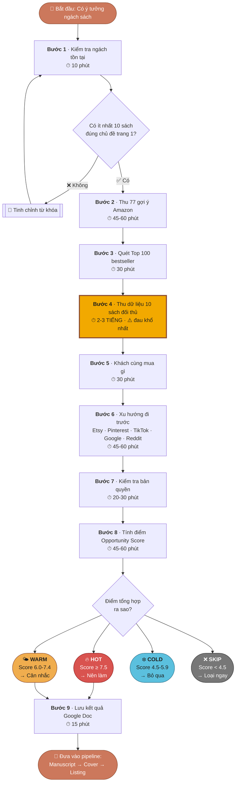
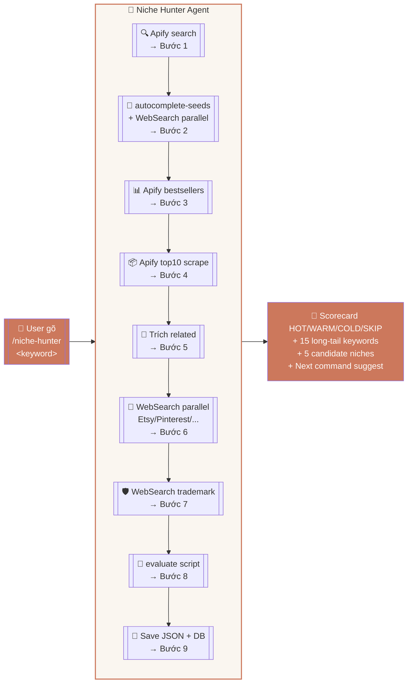

# Quy Trình Thủ Công Nghiên Cứu Ngách Sách KDP

> **Tài liệu giáo trình** — dùng để giải thích cho học viên hiểu rõ công việc Niche Hunter Agent đang tự động hóa.
>
> 9 bước chuẩn quốc tế, làm tay mất **6-8 tiếng** cho 1 ngách.
> Với `/niche-hunter`: **5-10 phút**.

---

## 🎯 Mục Đích Của Nghiên Cứu Ngách

Trước khi xuất bản 1 cuốn sách trên Amazon KDP, phải trả lời **6 câu hỏi**:

1. Ngách này có người mua không? (có cầu không)
2. Có bao nhiêu đối thủ đang bán? (cạnh tranh thế nào)
3. Giá bán bao nhiêu là hợp lý?
4. Sách đối thủ dày bao nhiêu trang?
5. Có đủ ý tưởng để làm 30-50 trang không?
6. Có dính bản quyền (Disney, Pokémon, nhân vật có thương hiệu) không?

Để trả lời đầy đủ và chính xác, làm theo quy trình 9 bước sau.

---

## 📊 Sơ Đồ Quy Trình



---

## 🔬 Chi Tiết 9 Bước

### Bước 1 — Kiểm Tra Ngách Có Tồn Tại Không · ⏱ 10 phút

- Mở trình duyệt, vào `amazon.com`
- Gõ từ khóa vào ô tìm kiếm, ví dụ `midnight botanical coloring book`
- Đếm số sách trang 1 có **đúng chủ đề** mình đang nhắm (không phải sách lạc đề)
- Nếu **dưới 10 cuốn match** → ngách quá hẹp hoặc không tồn tại → quay lại tinh chỉnh từ khóa
- Ghi: "Ngách có đủ độ lớn hay không"

---

### Bước 2 — Thu Thập Gợi Ý Tìm Kiếm Amazon · ⏱ 45-60 phút

**Bước tốn công nhất khi làm tay.** Mục đích: biết chính xác **người mua đang gõ gì**, vì Amazon gợi ý dựa trên volume tìm kiếm thật.

Phải làm 77 lần tra cứu:

| Loại probe | Pattern | Số lần |
|------------|---------|--------|
| Gốc + số nhiều | `keyword`, `keywords` | 2 |
| Hậu tố A-Z | `keyword + chữ cái` | 26 |
| Hậu tố số | `keyword + 0-9` | 10 |
| Tiền tố A-Z | `chữ cái + keyword` | 26 |
| Modifier đối tượng | `keyword + for seniors/women/beginners/...` | 13 |

Với mỗi lần: gõ vào Amazon search, chờ dropdown hiện 10 gợi ý, chép lại.

Sau đó: ngồi gom khoảng **300 cụm từ** thu được thành **20-30 long-tail mạnh nhất**, copy vào Google Sheet.

---

### Bước 3 — Quét Top 100 Sách Bán Chạy Danh Mục · ⏱ 30 phút

- Vào trang Best Sellers Amazon cho danh mục (Coloring → Grown-Ups → ...)
- Lướt 100 sách, chú ý cuốn nào thuộc ngách đang nhắm
- Ghi rank band: 1-20, 21-50, 51-100
- Scroll trang 2-3 nếu cần

---

### Bước 4 — Thu Dữ Liệu 10 Sách Đối Thủ Hàng Đầu · ⏱ 2-3 TIẾNG ⚠️

**Phần đau khổ nhất.** Với **mỗi cuốn** trong top 10 (làm 10 lần):

- Click vào trang sách
- Kéo xuống "Product details"
- Chép **Best Seller Rank** (BSR — số càng nhỏ càng bán chạy)
- Chép review count, avg rating
- Chép giá bán
- Chép số trang (Print length)
- Chép tên nhà xuất bản (phân biệt với tác giả)
- Chép ngày phát hành → trừ ra tính age
- Chép mã ASIN
- Dán tất cả vào Google Sheet

Mỗi sách 15-20 phút × 10 sách = 2-3 tiếng thao tác tay.

---

### Bước 5 — Xem "Khách Cùng Mua Gì" · ⏱ 30 phút

- Với top 3 sách, cuộn xuống "Customers who bought this item also bought"
- Ghi 10-20 sách liên quan
- Mở từng cuốn xem có phải ngách mới chưa khai thác không

---

### Bước 6 — Quét Xu Hướng Đi Trước Amazon · ⏱ 45-60 phút

Amazon là **chỉ số trễ**. Các nguồn sau đi trước 3-6 tháng:

| Nguồn | Cách check | Dùng để |
|-------|-----------|---------|
| **Etsy** | etsy.com → lọc "Best Seller" → xem 20 printable top | Cầu sản phẩm physical đang lên |
| **Pinterest Trends** | trends.pinterest.com → biểu đồ pin | Xu hướng thẩm mỹ đang nổi |
| **TikTok / BookTok** | Search hashtag → xem views | Viral potential |
| **Google Trends** | trends.google.com → 12 tháng + 5 năm | Evergreen vs spike |
| **Reddit** | r/coloringbooks, r/journaling, r/puzzles | Pain points thật |

---

### Bước 7 — Kiểm Tra Bản Quyền (IP Risk) · ⏱ 20-30 phút

- Search `<keyword> trademark` trên Google
- Kiểm tra uspto.gov nếu thấy brand đáng ngờ
- Search `<brand> amazon listing removed`
- Đối chiếu danh sách nhân vật branded: Disney, Pokémon, Marvel, Nintendo, Minecraft, Bluey, Peppa Pig
- Đánh dấu rủi ro: **CAO / TRUNG / THẤP**

---

### Bước 8 — Tính Toán Điểm Số Bằng Tay · ⏱ 45-60 phút

#### Công thức 1 — BSR → Sales/ngày

| BSR | Sales/ngày |
|-----|-----------|
| 1 – 100 | 900 |
| 101 – 1.000 | 160 |
| 1.000 – 5.000 | 45 |
| 5.000 – 10.000 | 17 |
| 10.000 – 25.000 | 9 |
| 25.000 – 50.000 | 5 |
| 50.000 – 100.000 | 2.5 |
| 100.000 – 200.000 | 1.2 |
| 200.000 – 500.000 | 0.4 |
| 500.000 – 1M | 0.12 |
| >1M | 0.03 |

#### Công thức 2 — Royalty mỗi cuốn

```
Chi phí in = 0.85 USD + (số trang × 0.012 USD)
Royalty/cuốn = (giá bán − chi phí in) × 60%
Monthly royalty = sales/ngày × 30 × royalty/cuốn
```

#### Công thức 3 — Opportunity Score

```
Opportunity = avg sales top 10 / avg reviews top 10

≥ 5     🌊 BLUE_OCEAN (ưu tiên)
2 – 5   MODERATE
0.5 – 2 COMPETITIVE
< 0.5   SATURATED (tránh)
```

#### Công thức 4 — Composite Score (thang 0-10)

```
Score = 0.25 × Opportunity
      + 0.20 × Demand
      + 0.15 × (10 − Competition)
      + 0.15 × Margin
      + 0.15 × Longevity
      + 0.10 × ContentScale
```

| Score | Rating |
|-------|--------|
| ≥ 7.5 | 🔥 HOT |
| 6.0 – 7.4 | 🌤 WARM |
| 4.5 – 5.9 | ❄️ COLD |
| < 4.5 | ❌ SKIP |

#### 6 Quy Tắc Loại Trực Tiếp (Hard Elimination)

Dính 1 trong 6 → SKIP ngay, không cần tính điểm:

1. Top 3 BSR đều > 300.000 → **dead_market**
2. Top 10 reviews đều > 500 → **over_saturated**
3. Top 10 giá ≤ 6.99 USD VÀ trang ≤ 50 → **race_to_bottom**
4. 6+ top 10 cùng nhà xuất bản → **single_publisher_lock**
5. Seasonal + còn < 75 ngày tới đỉnh → **seasonal_missed_window**
6. Có rủi ro bản quyền → **ip_trap**

---

### Bước 9 — Lưu Kết Quả · ⏱ 15 phút

- Tổng hợp thành file Google Doc / Notion
- Lưu vào Google Drive
- Ghi chú bước tiếp theo
- Cập nhật roadmap

---

## 📊 Sơ Đồ Tự Động Hóa — Với Niche Hunter



---

## 📈 So Sánh Làm Tay vs Tự Động

| Bước | Làm tay | Niche Hunter | Công cụ |
|------|---------|--------------|---------|
| 1. Kiểm tra ngách tồn tại | 10 phút | 5 giây | `apify_research.py search` |
| 2. Thu 77 gợi ý Amazon | **45-60 phút** | **1-2 phút** | `autocomplete-seeds` + WebSearch parallel |
| 3. Quét Top 100 bestseller | 30 phút | 10 giây | `apify_research.py bestsellers` |
| 4. **Thu dữ liệu 10 sách đối thủ** | **2-3 TIẾNG** ⚠️ | **30-60 giây** | `apify_research.py top10` |
| 5. Khách cùng mua gì | 30 phút | Tự động từ JSON Apify | - |
| 6. Xu hướng Etsy/Pinterest/Google | 45-60 phút | 1 phút | WebSearch parallel |
| 7. Kiểm tra bản quyền | 20-30 phút | 30 giây | WebSearch + pattern match |
| 8. Tính điểm | 45-60 phút | Tức thì | `amazon_research.py evaluate` |
| 9. Lưu kết quả | 15 phút | 5 giây | `db.py niches create` |
| **TỔNG** | **6-8 TIẾNG** | **5-10 PHÚT** | |

### Tăng tốc theo mode:

| Mode | Mục đích | Làm tay | Tự động |
|------|----------|---------|---------|
| **Single** (1 ngách) | Deep research đầy đủ 9 bước | 6-8 tiếng | 5-10 phút |
| **Batch** (15 ngách) | So sánh xếp hạng để chọn ngách tốt nhất | 90-120 tiếng (3-4 tuần) | 5-10 phút |
| **Autocomplete** (khám phá keyword) | Tìm ra long-tail từ seed rộng | 3-4 tiếng | 2-3 phút |

---

## ⚠️ Những Phần Tự Động Hóa KHÔNG Làm Thay Được

1. **Nhìn biểu đồ Pinterest Trends thật** — agent đọc text, nhưng cảm nhận đường cong cần con người
2. **Brainstorm 40 ý tưởng nội dung** — script đặt default 40 để tính điểm, danh sách thật do người/Agent 02 làm
3. **Kiểm tra bản quyền biên (trademarked phrases, tên người thật)** — cần `/trademark-guardian` chạy sâu
4. **Quyết định cuối cùng publish hay không** — người publish vẫn là người quyết định
5. **Phát hiện dữ liệu giả của Apify fuzzy match** — như case "midnight butterfly" bị inflated bởi 1 cuốn lạc đề

---

## 🧮 Tính Ra Tiết Kiệm Bao Nhiêu

Giả sử publish 1 cuốn sách/tuần:

- **Không có Niche Hunter**: 6-8 tiếng × 52 tuần = **312-416 tiếng/năm** chỉ riêng research
- **Có Niche Hunter**: 5-10 phút × 52 tuần = **5-9 tiếng/năm**
- **Tiết kiệm**: ~**300-400 tiếng/năm** = gần **2 tháng full-time**

Chưa kể chất lượng quyết định tốt hơn vì công thức chạy bằng máy không bị mệt mỏi hay cảm tính.

---

## 🎓 Tóm Tắt 1 Câu Cho Học Viên

> **"Niche Hunter làm thay công việc của 1 chuyên gia research thị trường KDP có kinh nghiệm — trong 5 phút thay vì 1 ngày — và không bao giờ mệt, không bỏ sót bước nào trong quy trình 9 bước chuẩn quốc tế."**

---

## 📚 Tham Khảo Thêm

- [SYSTEM-GUIDE.md](SYSTEM-GUIDE.md) — Hướng dẫn dùng toàn bộ KDP OS
- [KDP-COMPLIANCE.md](KDP-COMPLIANCE.md) — Luật bắt buộc của Amazon KDP
- [APIFY-SETUP.md](APIFY-SETUP.md) — Cấu hình token Apify
- Script nguồn: [scripts/amazon_research.py](../scripts/amazon_research.py), [scripts/apify_research.py](../scripts/apify_research.py)
- Skill gốc: [.claude/skills/niche-hunter/SKILL.md](../.claude/skills/niche-hunter/SKILL.md)
